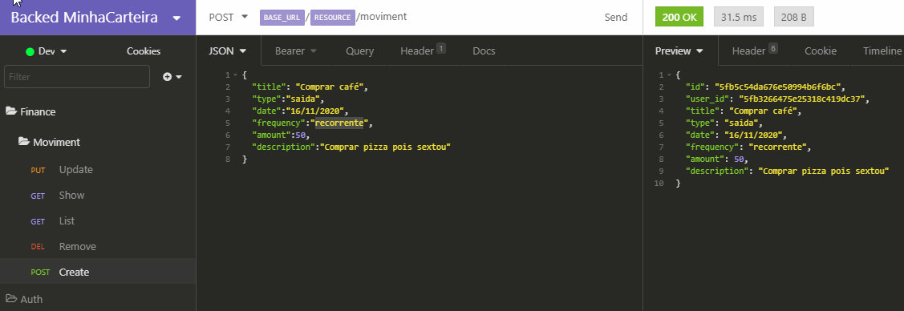

# DOCUMENTAÇÃO DE ROTAS UTILIZADAS NA API 🌳

Clique no botão abaixo para exportas as rotas para o **insomnia** 
(Preciso rever essa aula, pois meu projeto não estava no Git ainda) 🆘

## Sites Free usados para rodar em nuvem
Aplicação = Heroku
Mongo = Mongo Atlas

# 🔃 EXEMPLO UPDATE 🔃

 
 Ta com um probleminha no retorno mas funciona ✅
 
 Abração!!
